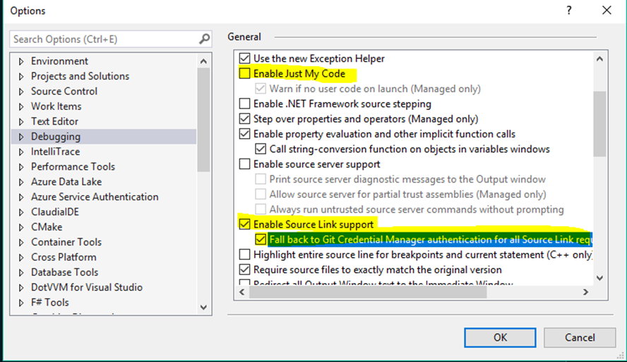

# Usage of this sample

This repo contains sample for my lecture on [DotNET Talks](https://www.dotnettalks.cz/) about using [SourceLink](https://github.com/dotnet/sourcelink). If you want to use this sample, just pack with dotnet cli - `dotnet pack` (build config is set to Debug by default). After pack, move or rename folder of this sample because [Portable PDB](https://github.com/dotnet/core/blob/master/Documentation/diagnostics/portable_pdb.md) also contains absolute path to sources). After that, create new test console app, reference NetStandardPackage.nupkg, enable Source ServerSupport and enjoy.

